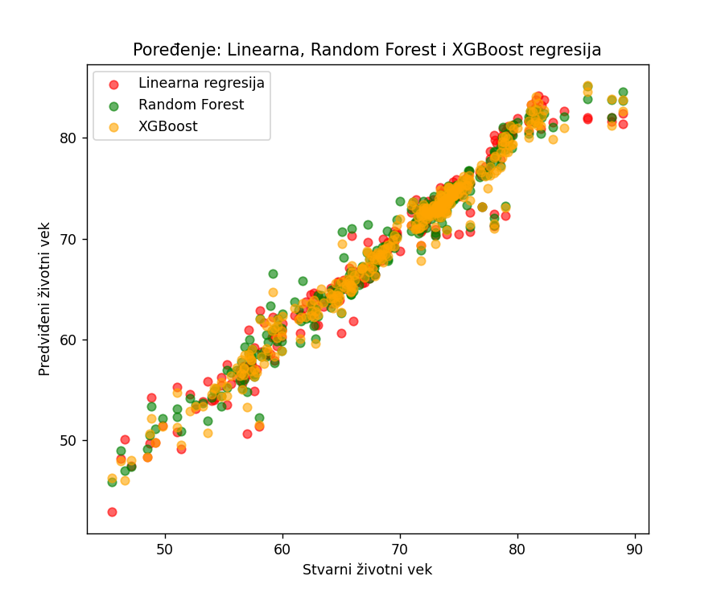

# Predviđanje životnog veka — life_expectancy2.py

Uvod
----
U ovom projektu analiziram skup podataka Life_Expectancy_Data.csv i koristim linearnu regresiju za predviđanje očekivanog životnog veka. Cilj je prikazati ceo tok rada: učitavanje i čišćenje podataka, osnovna vizualizacija, treniranje modela, evaluacija i poređenje moje implementacije sa implementacijom iz scikit‑learna.

Fajlovi u repozitorijumu
------------------------
- `life_expectancy2.py` — glavni Python skript koji izvodi sve korake analize i modeliranja.
- `Life_Expectancy_Data.csv` — dataset koji se koristi u skriptu.
- `README.md` — ovaj fajl.

Kratak opis postupka u skriptu
------------------------------
1. Učitavanje CSV fajla:
   - pandas.read_csv("Life_Expectancy_Data.csv")
2. Čišćenje imena kolona:
   - uklanjanje vodećih/zaostalih razmaka i zamena razmaka sa donjim crticama.
3. Ispis osnovnih informacija:
   - nazivi kolona, prvih 5 redova i deskriptivna statistika.
4. Vizualizacija:
   - histogram distribucije kolone `Life_expectancy`.
5. Korelaciona analiza:
   - računanje korelacija numeričkih kolona sa `Life_expectancy`.
6. Priprema podataka:
   - uklanjanje redova sa nedostajućim vrednostima (`dropna()`),
   - definisanje X (bez `Country`, `Status`, `Life_expectancy`) i y (`Life_expectancy`).
7. Podela podataka:
   - train/test podela (test_size=0.2, random_state=29).
8. Implementacija i treniranje modela:
   - moja implementacija linearne regresije pomoću normalne jednačine,
   - predikcija na test skupu.
9. Evaluacija:
   - izračunavanje MSE i R² za moju implementaciju.
10. Poređenje:
    - treniranje sklearn.linear_model.LinearRegression i upoređivanje metrike (MSE, R²).
11. Vizualni prikazi:
    - scatter plot stvarnih vs predviđenih vrednosti i poređenje moje i sklearn regresije.

Zahtevi i instalacija
----------------------
Potrebno:
- Python 3.8 ili noviji
- biblioteke: pandas, numpy, matplotlib, seaborn, scikit-learn

Preporučeni koraci:
```bash
python -m venv venv
# Linux / macOS
source venv/bin/activate
# Windows (PowerShell)
venv\Scripts\Activate.ps1

pip install pandas numpy matplotlib seaborn scikit-learn
```

Pokretanje
---------
Uveriti se da su `life_expectancy2.py` i `Life_Expectancy_Data.csv` u istom folderu (root repozitorijuma), pa pokrenuti:
```bash
python life_expectancy2.py
```
Skript će otvoriti grafike i ispisati metrike (MSE i R²) za moju implementaciju i za sklearn model.

Rezultati
---------
Skripta ispisuje osnovne statistike i korelacije, zatim izlazne metrike (MSE i R²) i crta grafikone koji prikazuju stvarne i predviđene vrednosti za test skup. Detaljni numerički rezultati zavise od sadržaja `Life_Expectancy_Data.csv` i trenutne obrade podataka.

## Rezultati modela

Rezultati moje regresije:
- MSE: 2.858350957161336  
- R²: 0.961382900827607  

### Poređenje sa sklearn modelom
Sklearn implementacija linearne regresije:
- MSE = 2.8583509571616847  
- R²  = 0.9613829008276024  

Random Forest rezultati:
- MSE = 2.5498629030303013  
- R²  = 0.9655506583767737  

XGBoost rezultati:
- MSE = 2.332585139555057  
- R²  = 0.9684861400813758  

---

### Vizuelno poređenje modela



Na slici je prikazano **poređenje sva tri modela**:  
- crvenom bojom označena je **linearna regresija**,  
- zelenom **Random Forest**,  
- žutom **XGBoost**.

Svi modeli pokazuju visoku tačnost jer su tačke raspoređene blizu dijagonale (linije gde su stvarne i predviđene vrednosti jednake).  
Ipak, može se primetiti da **Random Forest** i naročito **XGBoost** daju **stabilnije predikcije**, tj. tačke su bliže dijagonali, dok linearna regresija ima nešto veća odstupanja.

---

### Analiza rezultata

- **Linearni model** (moja i sklearn implementacija) objašnjava oko **96% varijanse** u podacima (R² ≈ 0.961) — što je vrlo dobar rezultat.  
- **Random Forest** daje još bolje performanse (R² ≈ 0.966) zahvaljujući mogućnosti da uhvati nelinearne odnose između varijabli.  
- **XGBoost** postiže **najbolji rezultat** (R² ≈ 0.968, najmanji MSE), jer koristi mehanizam gradijentnog pojačavanja i vrlo efikasno koriguje greške prethodnih stabala.  
- **Zaključak:** sva tri modela uspešno predviđaju očekivani životni vek, ali **Random Forest i XGBoost** daju preciznije i stabilnije rezultate u odnosu na linearnu regresiju.

---


Autor
-----
Mihajlo Timo (korisničko ime: @mihajlotimo)
